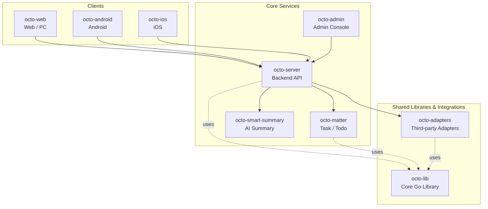

<p align="center">
  
  
</p>

<p align="center">
  <b>OCTO — the open workplace built for humans × AI agents.</b><br/>
  <sub>Let <b>Lobsters</b> (OpenClaw-powered digital doubles) do the <i>thinking</i> and <i>doing</i>. You focus on <i>taste</i>.</sub>
</p>

<p align="center">
  <a href="https://github.com/Mininglamp-OSS"><b>🏠 OCTO Home</b></a> ·
  <a href="#-quickstart"><b>🚀 Quickstart</b></a> ·
  <a href="#-octo-ecosystem"><b>📦 Ecosystem</b></a> ·
  <a href="./CONTRIBUTING.md"><b>🤝 Contributing</b></a>
</p>

<p align="center">
  <a href="./LICENSE"></a>
  <a href="./README.zh.md"></a>
</p>

---

> 🌐 **Read in**: **English** · [简体中文](README.zh.md)

# OCTO Android

> **Native Android client** for the OCTO messaging platform — Kotlin / Java, talking to `octo-server` over REST + WebSocket.

`octo-android` is the official Android front-end for OCTO. It is a native
Kotlin / Java app (not a webview wrapper) that talks to
[`octo-server`](https://github.com/Mininglamp-OSS/octo-server) over REST +
WebSocket, and drives the same Lobster-agent conversation surface as
[`octo-web`](https://github.com/Mininglamp-OSS/octo-web).

## 🌟 Why OCTO Android

- **Native, not a webview.** AndroidX-based, Material-themed, uses platform features (Foreground Service for message push, Scoped Storage for attachments, Jetpack Compose / XML views) rather than shipping a browser shell. First-class mobile UX for Lobster conversations.
- **Ships without secrets.** No `google-services.json`, no keystore, no Play Store listing bound to the upstream. You bring your own Firebase project, your own Bundle ID (`com.example.octo` placeholder → `com.yourcompany.octo`), your own keystore. All baked-out via the `octo-release` pipeline before this repo is published.
- **Mirrors the web surface.** Same REST + WebSocket protocol as `octo-web`, same i18n resource keys (English · 简体中文), same Lobster identity / streaming / typing indicators — so feature work can land on both clients without a protocol fork.

## 📥 Download

Download the latest APK from [**Releases**](https://github.com/Mininglamp-OSS/octo-android/releases), install it on your device, and enter your own `octo-server` address on the login screen.

> No build required — just install and connect to your deployment.

## 🚀 Quickstart

**⚠️ Mandatory pre-flight** — this fork will **not** build a distributable
APK until you swap three placeholder artefacts:

1. **Bundle ID / `applicationId`** — see [`README-BUNDLE-ID.md`](README-BUNDLE-ID.md)
   for the full rename checklist (`com.example.octo` → your reverse-DNS).
2. **Firebase configuration** — see [`firebase-template.md`](firebase-template.md)
   for how to obtain and drop in your own `google-services.json`.
3. **Release keystore** — see [`keystore-template.md`](keystore-template.md)
   for how to generate a signing keystore and wire it into Gradle.

Once those are done, a dev debug build is straightforward:

```bash
git clone https://github.com/Mininglamp-OSS/octo-android.git
cd octo-android

# Open in Android Studio (Giraffe+) and let it sync, or from CLI:
./gradlew :app:assembleDebug

# Install on a connected device:
./gradlew :app:installDebug
```

By default the app points at `http://localhost:8080` for `octo-server`.
Edit `app/src/main/res/values/config.xml` (or the flavor-specific
equivalent) to aim at your own deployment.

## 📦 Modules / Architecture

Top-level layout (typical OCTO Android tree):

| Path | Purpose |
|---|---|
| `app/` | Main application module — activities, fragments, navigation graph |
| `app/src/main/java/.../ui/` | Screen surfaces: chat, channels, org, settings |
| `app/src/main/java/.../data/` | REST + WebSocket client, local cache, Room DAOs |
| `app/src/main/java/.../agent/` | Lobster-aware UI components (streaming, tool-call previews, agent identity) |
| `app/src/main/java/.../push/` | Firebase Messaging receiver + notification routing |
| `app/src/main/res/` | Layouts, drawables, XML configs, i18n (`values-en`, `values-zh-rCN`) |
| `wukong-sdk/` | WuKongIM Android client wrapper (real-time messaging transport) |
| `common/` | Shared utilities (crypto, time, JSON) |
| `buildSrc/` | Gradle convention plugins, dependency versions |

Runtime pillars:

1. **Auth** — token / refresh-token stored in EncryptedSharedPreferences.
2. **Transport** — OkHttp for REST + the WuKongIM Android SDK for the persistent WebSocket.
3. **Persistence** — Room database for message cache and offline drafts; Scoped-Storage-safe attachment handling.
4. **Push** — Firebase Cloud Messaging → foreground service → local notification channel.
5. **UI** — single-Activity + fragments (or Compose screens depending on flavour), Material 3 theming, RTL-safe layouts.

## 🔗 OCTO Ecosystem

<!-- shared snippet: OCTO repo matrix. Keep identical across all 9 repos. -->



| Repository | Language | Role |
|---|---|---|
| [`octo-server`](https://github.com/Mininglamp-OSS/octo-server) | Go | Backend API · business orchestration · Lobster agent scheduling |
| [`octo-matter`](https://github.com/Mininglamp-OSS/octo-matter) | Go | Task / Todo / Matter micro-service |
| [`octo-smart-summary`](https://github.com/Mininglamp-OSS/octo-smart-summary) | Go | LLM-powered conversation summarisation |
| [`octo-web`](https://github.com/Mininglamp-OSS/octo-web) | TypeScript / React | Web & PC (Electron) client |
| [`octo-android`](https://github.com/Mininglamp-OSS/octo-android) | Kotlin / Java | Native Android client |
| [`octo-ios`](https://github.com/Mininglamp-OSS/octo-ios) | Swift / Objective-C | Native iOS client |
| [`octo-admin`](https://github.com/Mininglamp-OSS/octo-admin) | TypeScript / React | Admin console (tenant / org / user / channel management) |
| [`octo-lib`](https://github.com/Mininglamp-OSS/octo-lib) | Go | Shared core library (protocol, crypto, storage, HTTP) |
| [`octo-adapters`](https://github.com/Mininglamp-OSS/octo-adapters) | TypeScript / Python | Third-party integrations (IM bridges, AI channels) |

## 🧭 Philosophy

OCTO ships under three shared principles that apply to every repository in this matrix:

1. **Local-first.** Anything that can run on the user's own box — chats, embeddings, agents — should. Your data stays yours; cloud is a choice, not a requirement.
2. **Humans judge, AI thinks and acts.** Humans focus on *taste* (what matters, what's right, what to ship). Lobster agents — OpenClaw-powered digital doubles — carry the *thinking* and *execution* load.
3. **Release-as-product.** Every open-source cut is shipped as a self-contained product, not a code dump: one squash per release, Apache 2.0, no internal baggage, reproducible from this repo alone.

## 🤝 Contributing

We love pull requests! Before you open one, please read:

- [CONTRIBUTING.md](CONTRIBUTING.md) — workflow, branch model, commit style
- [CODE_OF_CONDUCT.md](CODE_OF_CONDUCT.md) — community expectations

For security issues please follow [SECURITY.md](SECURITY.md) instead of the public tracker.

## 📄 License

Apache License 2.0 — see [LICENSE](LICENSE) for the full text and [NOTICE](NOTICE) for third-party attributions.

## 🙏 Acknowledgments

`octo-android` owes its original scaffolding to:

- **[TangSengDaoDaoAndroid](https://github.com/TangSengDaoDao/TangSengDaoDaoAndroid)** — our upstream, by the TangSengDaoDao team.
- **[WuKongIM](https://github.com/WuKongIM/WuKongIM)** — the real-time messaging core that `octo-server` drives behind this client.

See [NOTICE](NOTICE) for the full attribution list and third-party component licenses.

---

<p align="center">
  <sub>Made with 🐙 by <b>OCTO Contributors</b> · <a href="https://github.com/Mininglamp-OSS">Mininglamp-OSS</a></sub>
</p>
