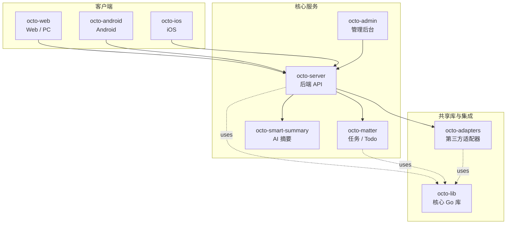

<p align="center">
  
  
</p>

<p align="center">
  <b>OCTO —— 为人和 AI Agent 协作而生的开源工作平台。</b><br/>
  <sub>让 <b>龙虾（Lobster / OpenClaw-powered digital double agents）</b>去「思」和「行」，让人专注于「品」。</sub>
</p>

<p align="center">
  <a href="https://github.com/Mininglamp-OSS"><b>🏠 OCTO 主页</b></a> ·
  <a href="#-快速开始"><b>🚀 快速开始</b></a> ·
  <a href="#-octo-生态"><b>📦 生态</b></a> ·
  <a href="./CONTRIBUTING.zh.md"><b>🤝 贡献</b></a>
</p>

<p align="center">
  <a href="./LICENSE"></a>
  <a href="./README.md"></a>
</p>

---

> 🌐 **语言**: [English](README.md) · **简体中文**

# OCTO Android（简体中文）

> **原生 Android 客户端** —— Kotlin / Java 编写，通过 REST + WebSocket 与 `octo-server` 通信。

`octo-android` 是 OCTO 消息平台的官方 Android 客户端 —— 原生 Kotlin / Java
应用（非 WebView 壳），通过 REST + WebSocket 访问
[`octo-server`](https://github.com/Mininglamp-OSS/octo-server)，承载与
[`octo-web`](https://github.com/Mininglamp-OSS/octo-web) 一致的龙虾 Agent
会话体验。

## 🌟 为什么选 OCTO Android

- **原生应用，而不是 WebView。** 基于 AndroidX，Material 主题，使用平台特性（前台 Service 处理消息推送、Scoped Storage 处理附件、Jetpack Compose / XML 视图），而不是套一层浏览器壳。为龙虾会话提供一等公民的移动端体验。
- **开箱不带任何密钥。** 没有 `google-services.json`、没有 keystore、不绑任何 Play Store 上架。上游 `octo-release` 流水线在发布前就烘出所有敏感项 —— 你需要自带 Firebase 项目、自带 Bundle ID（从占位符 `com.example.octo` 改为 `com.yourcompany.octo`）、自带签名 keystore。
- **与 Web 端保持对齐。** 与 `octo-web` 使用同一套 REST + WebSocket 协议、同一套 i18n key（英文 · 简体中文）、同一套 Lobster 身份 / 流式 / 输入提示逻辑 —— 特性工作可以同时在两端落地，不必分叉协议。

## 🚀 快速开始

**⚠️ 发布前必做** —— 这份 fork **不**能直接产出可分发的 APK。请先替换三类占位产物：

1. **Bundle ID / `applicationId`** —— 见 [`README-BUNDLE-ID.md`](README-BUNDLE-ID.md)
   （把 `com.example.octo` 改为你自己的反向 DNS 名）。
2. **Firebase 配置** —— 见 [`firebase-template.md`](firebase-template.md)
   （如何获取并落入你自己的 `google-services.json`）。
3. **签名 keystore** —— 见 [`keystore-template.md`](keystore-template.md)
   （如何生成签名 keystore 并接入 Gradle）。

以上完成后，开发 debug 构建很直接：

```bash
git clone https://github.com/Mininglamp-OSS/octo-android.git
cd octo-android

# 用 Android Studio（Giraffe+）打开让它 sync，或走 CLI：
./gradlew :app:assembleDebug

# 安装到已连接的设备：
./gradlew :app:installDebug
```

默认连 `http://localhost:8080` 的 `octo-server`。如需指向你自己的部署，
编辑 `app/src/main/res/values/config.xml`（或 flavor 专属的同名文件）。

## 📦 模块与架构

顶层结构（典型 OCTO Android 工程）：

| 路径 | 作用 |
|---|---|
| `app/` | 主应用模块 —— activity / fragment / navigation graph |
| `app/src/main/java/.../ui/` | 页面：会话 / 频道 / 组织 / 设置 |
| `app/src/main/java/.../data/` | REST + WebSocket 客户端、本地缓存、Room DAO |
| `app/src/main/java/.../agent/` | 龙虾感知的 UI 组件（流式、工具调用预览、Agent 身份） |
| `app/src/main/java/.../push/` | Firebase Messaging 接收器 + 通知路由 |
| `app/src/main/res/` | 布局、资源、XML 配置、i18n（`values-en`、`values-zh-rCN`） |
| `wukong-sdk/` | WuKongIM Android 客户端封装（实时消息传输） |
| `common/` | 共享工具（加密、时间、JSON） |
| `buildSrc/` | Gradle 约定插件、依赖版本 |

运行时支柱：

1. **Auth（认证）** —— token / refresh-token 存在 EncryptedSharedPreferences。
2. **Transport（传输）** —— REST 走 OkHttp，持久 WebSocket 走 WuKongIM Android SDK。
3. **Persistence（持久化）** —— Room 数据库存消息缓存与离线草稿；附件处理兼容 Scoped Storage。
4. **Push（推送）** —— Firebase Cloud Messaging → 前台 Service → 本地通知 channel。
5. **UI（界面）** —— 单 Activity + fragment（或 Compose 屏幕，视 flavor 而定），Material 3 主题，RTL 安全布局。

## 🔗 OCTO 生态

<!-- 共享片段：OCTO 仓库矩阵。9 个仓库之间保持一致。 -->



| 仓库 | 语言 | 职责 |
|---|---|---|
| [`octo-server`](https://github.com/Mininglamp-OSS/octo-server) | Go | 后端 API · 业务编排 · 龙虾 Agent 调度 |
| [`octo-matter`](https://github.com/Mininglamp-OSS/octo-matter) | Go | 任务 / Todo / Matter 微服务 |
| [`octo-smart-summary`](https://github.com/Mininglamp-OSS/octo-smart-summary) | Go | 基于 LLM 的会话摘要服务 |
| [`octo-web`](https://github.com/Mininglamp-OSS/octo-web) | TypeScript / React | Web 与 PC（Electron）客户端 |
| [`octo-android`](https://github.com/Mininglamp-OSS/octo-android) | Kotlin / Java | 原生 Android 客户端 |
| [`octo-ios`](https://github.com/Mininglamp-OSS/octo-ios) | Swift / Objective-C | 原生 iOS 客户端 |
| [`octo-admin`](https://github.com/Mininglamp-OSS/octo-admin) | TypeScript / React | 管理后台（租户 / 组织 / 用户 / 频道管理） |
| [`octo-lib`](https://github.com/Mininglamp-OSS/octo-lib) | Go | 共享核心库（协议 / 加密 / 存储 / HTTP） |
| [`octo-adapters`](https://github.com/Mininglamp-OSS/octo-adapters) | TypeScript / Python | 第三方集成（IM 桥接、AI 渠道） |

## 🧭 设计哲学

OCTO 遵循三条共用原则 —— 这套矩阵里的每个仓都一致：

1. **本地优先（Local-first）。** 能跑在用户本机的一切（对话、向量、智能体）都应尽量在本机完成。你的数据属于你；云是可选项，不是前置条件。
2. **人做「品」，AI 做「思」与「行」。** 人聚焦在品味（什么重要、什么对、该发什么）。龙虾（OpenClaw 驱动的数字分身）承担思考与执行。
3. **Release-as-product（每次发布即产品）。** 每一次开源切片都是一个自洽的产品，不是代码倾倒：一个 release 一次 squash，Apache 2.0，不夹带内部包袱，单仓即可复现。

## 🤝 贡献

欢迎提 Pull Request！开 PR 前请先读：

- [CONTRIBUTING.zh.md](CONTRIBUTING.zh.md) —— 工作流、分支模型、commit 规范
- [CODE_OF_CONDUCT.zh.md](CODE_OF_CONDUCT.zh.md) —— 社区行为准则

安全问题请按 [SECURITY.zh.md](SECURITY.zh.md) 上报，不要走公开 issue。

## 📄 许可

Apache License 2.0 —— 完整文本见 [LICENSE](LICENSE)，第三方致谢见 [NOTICE](NOTICE)。

## 🙏 致谢

`octo-android` 的初始脚手架来自以下开源项目：

- **[TangSengDaoDaoAndroid](https://github.com/TangSengDaoDao/TangSengDaoDaoAndroid)** —— 上游项目，由 TangSengDaoDao 团队开发。
- **[WuKongIM](https://github.com/WuKongIM/WuKongIM)** —— 实时消息内核，由 `octo-server` 驱动。

完整的致谢与第三方组件清单见 [NOTICE](NOTICE)。

---

<p align="center">
  <sub>由 <b>OCTO Contributors</b> 🐙 共同开发 · <a href="https://github.com/Mininglamp-OSS">Mininglamp-OSS</a></sub>
</p>
